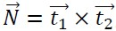
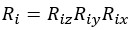
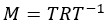
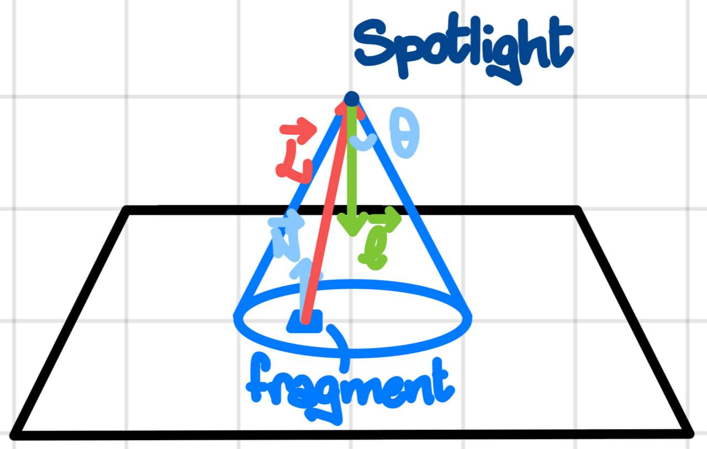
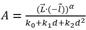
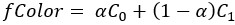
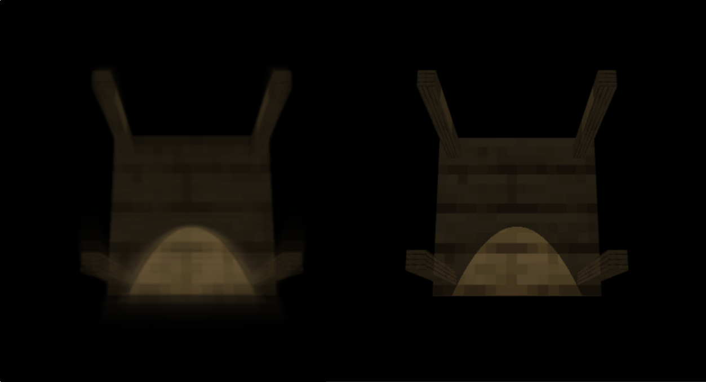

# Interactive Graphics 2021/2022

Homework 1, Minut Robert Adrian, 1942806

## 1. Table Model

For the table I took a simple cube from the examples. Then I wrote some arrays with the appropriate vectors containing the scales and positions (for translation) in order to build a table by using the instancing of multiple cubes. This way I was able to reuse the same vertices and instantiate the cubes by redrawing them with the appropriate model matrix that we calculate by using the scale and position arrays mentioned before. By using this method, I only needed to pass the vertices of the cube, which in my case were 36, because I used the cube model from the examples, but this number can be lowered to 8 instead of 20 to 40 like it would usually be necessary when modeling the whole table. Instancing requires some additional setup, and we need to pass different model matrices (as uniforms) for each part of the table (legs and table plane).
Normal vectors are calculated as:

Where t1 and t2 are the vectors that span the plane defined by one of the two triangles which compose the face of the cube. t1 and t2 are calculated by using the difference between the positions of the vertices.

## 2. Rotation

For rotation I followed the examples, so I used a theta variable that contains the rotation angles for all 3 axes. I implemented a function that builds the rotation matrix by providing all 3 of the angles, instead of passing them one at a time. This function also takes into account the origin of the rotation axes and constructs the appropriate matrix by using the idea discussed during the lectures: translate the object to the origin of rotation, then rotate with respect to the object's origin and then translate the object back to the initial position. I added some additional control options for setting the preferred rotation origin instead of setting an origin myself.
For the rotation matrix I use the formula:
.

Then, to account for the rotation origin I calculate:

To make the motion of the table look smoother I added the calculation of the deltaTime, which allows the keep track of how much time passed since the last drawn frame. This value can then be used for compensating the amount of rotation of the object, it also has similar uses for motion related effects. This concept is very common in game engines like Unity, with which I have some experience.

## 3. Camera

I implemented the camera and viewing volume controls by following the examples. For the controls we have the Z far and near planes, the R distance from the world origin, and finally the phi and theta angles that allow us to look around by tilting the camera.
I separated the Model, View, and Perspective matrices for a finer control on the calculations in the shaders, and to better understand what effects each of them has.

## 4. Spotlight

I implemented the spotlight by following the suggestions given during the lectures.
All of the lighting calculations were made in world coordinates.
First, I made a drawing of the main vectors involved in the lighting calculations.

By calculating the dot product between the vectors L and -l (light direction), and comparing the result to the cosine of the opening angle, we can find out if the fragment is inside of the light cone produced by the spotlight.
If the fragment is in light then we use the dot product between the normal N and the vector L to calculate the amount of light received by the fragment.
I implemented the attenuation factor first by calculating the dot product between L and -l, and taking the power of the result by using some alpha exponent, like it was mentioned in the slides.
This kind of attenuation produces an effect that results in the light being more focused in the direction of the light. Then, I also considered the distance between the fragment and the spotlight, which made the light cone more realistically looking.
In summary, the attenuation is given by:

Where d is the distance between the fragment and the spotlight.
I added an additional slider to control the intensity of the spotlight.

## 5. Material

For the material properties I gave the default (1.0) value to the diffuse absorption coefficient, and lowered the specular coefficient to 0.5 for all 3 channels because wood usually has more of a matte look, which implies a lower specular component.

## 6. Shading models

I implemented the lighting calculations in both the vertex and the fragment shader, and I can distinguish between the two cases (per fragment or per vertex) by using a boolean uniform. I was able to reuse the shader, but this way I added more complexity to the code. Also, in production it would be better to have separate shaders because if cases are costly since the shader code is run several times for each frame.

## 7. Texture

The texture looks like the wood texture from the popular game named 'Minecraft'. The implementation follows the examples, since I cover all of the cube's faces with the same texture.

## 8. Motion Blur

After several attempts, made by trying different kinds of techniques, I was able to obtain a graphically pleasant motion blur effect by interpolating two textures, one that contains the past frame and one that contains the drawing of the table with the current parameters. From a certain perspective, I accumulate the past frames into the first texture, and then I use it to create the motion blur effect.
The color of a pixel in position (x,y) in screen space coordinates is given by:

Where C0 is the texel of the texture containing the past frame, and C1 the texel of the texture containing the table drawn with the current frame’s parameters, both texels are sampled at (x,y).
To make the effect look better I added more blurring by using a weighted average of the neighboring texels, for which I considered a 3x3 window of samples. Each neighboring texel is multiplied by a weight which is inversely proportional to the distance from the current texture coordinates (x,y). This blurring is influenced by the perceived speed, which is obtained by multiplying the deltaTime by the rotation speed. The speed is used to determine the maximum distance of the sampled texels. Also, when there is no rotation, the speed is set to 0 so that we don't have any unneeded blur.

